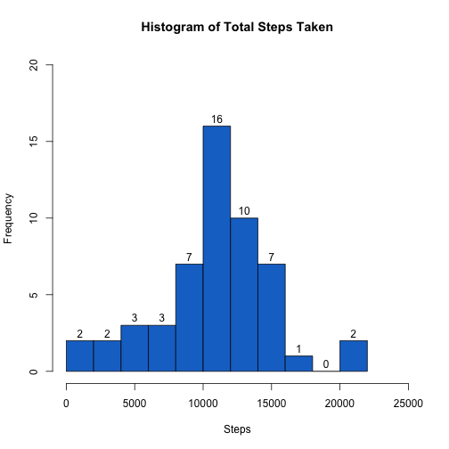
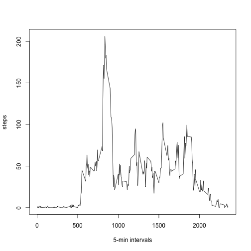
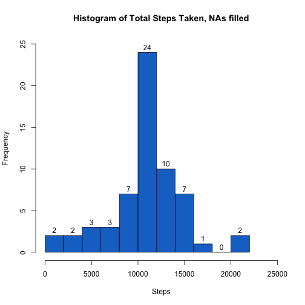
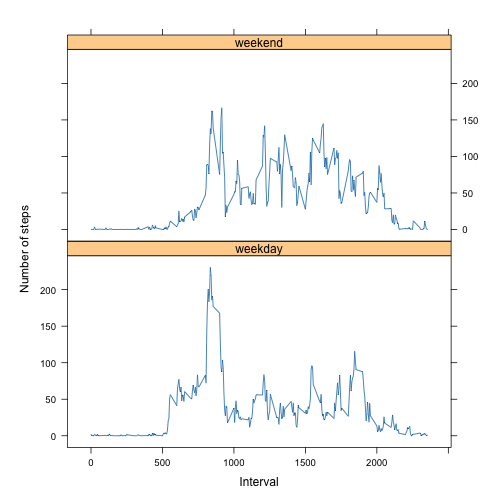

# Activity Monitoring Data Analysis

Created by Timo Ruohomäki, 19 July, 2023  
Link to Github repo: https://github.com/timoruohomaki/Coursera/tree/main/Reproducible-Research/CP1 


## Load libraries


```r
library(lubridate)
library(scales)
library(lattice)
library(knitr)
```

## Loading and preprosessing the data

This code downloads the zip dataset, extracts it in new ./data -folder in the workspace.  
Of the extracted file, activityData -object is created with 17568 observatinos and 3 variables.  
The data is tidied by setting the date format using lubridate -library.  
stepsTotal -dataframe stores an daily aggregated set of non-NA values.


```r
if(!file.exists("./data")){dir.create("./data")}
if(!file.exists("./figure")){dir.create("./figure")}

dataurl <- "https://d396qusza40orc.cloudfront.net/repdata%2Fdata%2Factivity.zip"
datazip <- "./data/activity.zip"
download.file(dataurl, datazip)

if(file.exists(datazip)) unzip(datazip, exdir ="./data")

rm(dataurl, datazip)

activityData <- read.csv("./data/activity.csv")

activityData$date <- ymd(activityData$date)

stepsNA <- sum(is.na(activityData$steps))

stepsTotal <- aggregate(steps~date,data=activityData,sum,na.rm=TRUE)

summary(activityData)
```

```
##      steps             date               interval     
##  Min.   :  0.00   Min.   :2012-10-01   Min.   :   0.0  
##  1st Qu.:  0.00   1st Qu.:2012-10-16   1st Qu.: 588.8  
##  Median :  0.00   Median :2012-10-31   Median :1177.5  
##  Mean   : 37.38   Mean   :2012-10-31   Mean   :1177.5  
##  3rd Qu.: 12.00   3rd Qu.:2012-11-15   3rd Qu.:1766.2  
##  Max.   :806.00   Max.   :2012-11-30   Max.   :2355.0  
##  NA's   :2304
```

```r
summary(stepsTotal)
```

```
##       date                steps      
##  Min.   :2012-10-02   Min.   :   41  
##  1st Qu.:2012-10-16   1st Qu.: 8841  
##  Median :2012-10-29   Median :10765  
##  Mean   :2012-10-30   Mean   :10766  
##  3rd Qu.:2012-11-16   3rd Qu.:13294  
##  Max.   :2012-11-29   Max.   :21194
```

The variables included in this dataset are:

- steps: Number of steps taking in a 5-minute interval (missing values are coded as NA)
- date: The date on which the measurement was taken in YYYY-MM-DD format
- interval: Identifier for the 5-minute interval in which measurement was taken

## Q1: What is mean and median number of steps taken per day?


```r
hist(stepsTotal$steps, breaks = 10, ylim = c(0,20), xlim = c(0,25000),col = "dodgerblue3",labels = TRUE, xlab = "Steps", main = paste("Histogram of Total Steps Taken"))
```



```r
meanSteps <- as.integer(mean(stepsTotal$steps))
medianSteps <- as.integer(median(stepsTotal$steps))
```

**Answer 1:** The mean of total number of steps is
10766
.

**Answer 2:** The median of total number of steps taken is
10765
.

## Q2: What is the average daily activity pattern?

* Make a time series plot (i.e. type = "l" type = "l") of the 5-minute interval (x-axis) and the average number of steps taken, averaged across all days (y-axis)


```r
stepsInterval <- aggregate(steps~interval,data=activityData,mean,na.rm=TRUE)
plot(steps~interval,data=stepsInterval,type="l",xlab="5-min intervals")
```



* Which 5-minute interval, on average across all the days in the dataset, contains the maximum number of steps?


```r
stepsInterval[which.max(stepsInterval$steps),]$interval
```

```
## [1] 835
```

**Answer 3:** The **835th** interval contains the maximum number of steps.

## Imputing missing values

1. Calculate and report the total number of missing values in the dataset (i.e. the total number of rows with NAs) 

**Answer 4:** Of the provided
17568
values,
2304
(
13%
)
is currently missing the number of steps and were ignored.

2. Devise a strategy for filling in all of the missing values in the dataset. The strategy does not need to be sophisticated. For example, you could use the mean/median for that day, or the mean for that 5-minute interval, etc.

**Answer 5: Using the mean value of 5-min interval to fill in the missing values in a new function as follows:**


```r
fillSteps <- function(interval){
    stepsInterval[stepsInterval$interval==interval,]$steps
}
```

3. Create a new dataset that is equal to the original dataset but with the missing data filled in.


```r
activityDataFilled <- activityData
count=0
for(i in 1:nrow(activityDataFilled)){
    if(is.na(activityDataFilled[i,]$steps)){
        activityDataFilled[i,]$steps <- fillSteps(activityDataFilled[i,]$interval)
        count=count+1
    }
}
```

**In total, 2304 observations with missing values were replaced with mean values.**

4. Make a histogram of the total number of steps taken each day and Calculate and report the **mean** and **median** total number of steps taken per day. 


```r
stepsTotalFilled<-aggregate(steps~date,data=activityDataFilled,sum)
hist(stepsTotalFilled$steps, breaks = 10, ylim = c(0,25), xlim = c(0,25000),col = "dodgerblue3",labels = TRUE, xlab = "Steps", main = paste("Histogram of Total Steps Taken, NAs filled"))
```



```r
mean(stepsTotalFilled$steps)
```

```
## [1] 10766.19
```

```r
median(stepsTotalFilled$steps)
```

```
## [1] 10766.19
```

**Answer 6:** The mean of total number of steps is
10766
.

**Answer 7:** The median of total number of steps taken is
10766
.

Do these values differ from the estimates from the first part of the assignment? What is the impact of imputing missing data on the estimates of the total daily number of steps?

**Answer 8:** The **mean** value is the same as before filling the NAs due to filling method, on **median** there is a slight variation. The impact and variation are so small that imputing missing data seems to be unnecessary.


## Q3: Are there differences in activity patterns between weekdays and weekends?

1. Create a new factor variable in the dataset with two levels -- "weekday" and "weekend" indicating whether a given date is a weekday or weekend day.


```r
activityDataFilled$typeofday = ifelse(as.POSIXlt(as.Date(activityDataFilled$date))$wday%%6==0,
                          "weekend","weekday")
# For Sunday and Saturday : weekend, Other days : weekday 
activityDataFilled$typeofday = factor(activityDataFilled$typeofday,levels=c("weekday","weekend"))
```

2. Make a panel plot containing a time series plot (i.e. type = "l") of the 5-minute interval (x-axis) and the average number of steps taken, averaged across all weekday days or weekend days (y-axis).


```r
stepsInterval2 = aggregate(steps~interval+typeofday,activityDataFilled,mean)

my.settings <- list(
  strip.background=list(col="burlywood1"),
  strip.border=list(col="black")
)

xyplot(steps~interval|factor(typeofday),data=stepsInterval2,aspect=1/2,ylab = "Number of steps", xlab = "Interval", type="l", par.settings = my.settings)
```



**Answer 9:** The plot above illustrates the differences between the weekdays and weekends.
